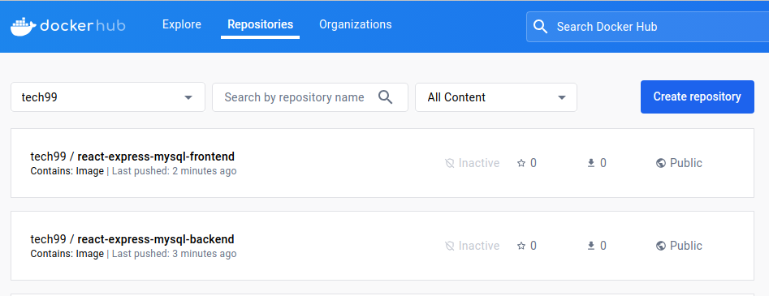

## docker-react-express-mysql sample application

### React application with a NodeJS backend and a MariaDB database

Project structure:
```
.
├── backend
│   ├── Dockerfile
│   ...
├── db
│   └── password.txt
├── compose.yaml
├── frontend
│   ├── ...
│   └── Dockerfile
└── README.md
```

[_compose.yaml_](compose.yaml)
```
services:
  backend:
    build: backend
    ports:
      - 80:80
      - 9229:9229
      - 9230:9230
    ...
  db:
    image: mariadb:10.6.4-focal
    
    ...
  frontend:
    build: frontend
    ports:
    - 3000:3000
    ...
```
The compose file defines an application with three services `frontend`, `backend` and `db`.
When deploying the application, docker compose maps port 3000 of the frontend service container to port 3000 of the host as specified in the file.
Make sure port 3000 on the host is not already being in use.


## Deploy with docker compose

```
# To run docker containers on development environment
$ ./run_dev.sh  
OR

# To run docker containers on production environment
$ ./run_pord.sh 
```

## Expected result

Listing containers must show containers running and the port mapping as below:
```
$ docker ps
CONTAINER ID        IMAGE                          COMMAND                  CREATED             STATUS                   PORTS                                                  NAMES
f3e1183e709e        docker-react-express-mysql_frontend   "docker-entrypoint.s…"   8 minutes ago       Up 8 minutes             0.0.0.0:3000->3000/tcp                                 docker-react-express-mysqll_frontend_1
9422da53da76        docker-react-express-mysql_backend    "docker-entrypoint.s…"   8 minutes ago       Up 8 minutes (healthy)   0.0.0.0:80->80/tcp, 0.0.0.0:9229-9230->9229-9230/tcp   docker-react-express-mysql_backend_1
a434bce6d2be        mysql:8.0.19                   "docker-entrypoint.s…"   8 minutes ago       Up 8 minutes             3306/tcp, 33060/tcp                                    docker-react-express-mysql_db_1
```

After the application starts, navigate to `http://localhost:3000` in your web browser.


The backend service container has the port 80 mapped to 80 on the host.
```
$ curl localhost:80
{"message":"Hello from MySQL 8.0.19"}
```

Stop and remove the containers
```
$ docker compose down
Stopping docker-react-express-mysql_frontend_1 ... done
Stopping docker-react-express-mysql_backend_1  ... done
Stopping docker-react-express-mysql_db_1       ... done
Removing docker-react-express-mysql_frontend_1 ... done
Removing docker-react-express-mysql_backend_1  ... done
Removing docker-react-express-mysql_db_1       ... done
Removing network docker-react-express-mysql_default

```
## Push frontend and backend images to hub.docker.com

- Tag the `frontend` and `backend` images as `from tech99/react-express-mysql-frontend` and `from tech99/react-express-mysql-backend  ` respectively.
- login to hub.docker.com
  > docker login

- build the images
  > docker compose build

- push the images
  > docker compose push

After the images push completed, navigate to `https://hub.docker.com` in your web browser.



## Implement exporting database from the database server and use this dump file as a backup

- Created a shell script name `db_backup_script.sh`
  ```shell
  #!/bin/bash

  if [ "$#" -ne 5 ]; then
      echo "Usage: $0 <databaseuser> <servicename> <password> <databasename> <outputfile>"
      exit 1
  fi

  DB_USER="$1"
  SERVICE_NAME="$2"
  PASSWORD="$3"
  DB_NAME="$4"
  OUTPUT_FILE="$5"

  NOW=$(date +"%Y-%m-%d-%H-%M-%S")
  DUMP_COMMAND="docker compose exec $SERVICE_NAME /usr/bin/mysqldump -u $DB_USER --password=$PASSWORD $DB_NAME > $(pwd)/$OUTPUT_FILE-$NOW.sql"

  eval "$DUMP_COMMAND"

  if [ $? -eq 0 ]; then
      echo "Database backup completed successfully. Output file: $OUTPUT_FILE"
  else
      echo "Error: Database backup failed."
  fi
  
  ```
- This script will take following 5 arguments 
  ` <databaseuser> <servicename> <password> <databasename> <outputfile> `
  
  > sudo ./db_backup_script.sh root db db-btf5q example backup_exampleDB

- This will create a dumpfile name `backup_exampleDB-2023-12-11-03-01-09.sql`